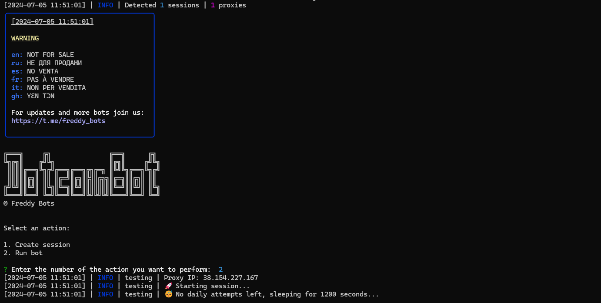

> [](https://t.me/roddyfred)



# Use Node.Js 18 or greater

## Functionality

| Functional                                                    | Supported |
| ------------------------------------------------------------- | :-------: |
| Performing lucky doubling coins                               |    ✅     |
| Multithreading                                                |    ✅     |
| Binding a proxy to a session                                  |    ✅     |
| Auto-purchase of items if you have coins (multitap, attempts) |    ✅     |
| Use sessions/query_ids                                        |    ✅     |
| Binding a proxy to a session/query_id                         |    ✅     |
| Random number of clicks per request                           |    ✅     |

### [How to add query id](https://github.com/Freddywhest/RockyRabbitBot/blob/main/AddQueryId.md)

## [Settings](https://github.com/FreddyWhest/DotcoinBot/blob/main/.env-example)

| Settings                         | Description                                                                               |
| -------------------------------- | ----------------------------------------------------------------------------------------- |
| **API_ID / API_HASH**            | Platform data from which to launch a Telegram session (stock - Android)                   |
| **AUTO_UPGRADE_MULTITAP**        | Whether the bot should upgrade the multitap (True / False)                                |
| **MAX_MULTITAP_LEVEL**           | Maximum level of multitap (eg 5)                                                          |
| **AUTO_UPGRADE_ATTEMPTS**        | Whether the bot should upgrade the daily attempts (True / False)                          |
| **MAX_ATTEMPTS**                 | Maximum daily attempts (eg 11)                                                            |
| **AUTO_CLAIM_TASKS**             | Whether the bot should claim tasks (True / False)                                         |
| **AUTO_PLAY_SPIN_TO_EARN**       | Whether the bot should play spin to earn game (True / False)                              |
| **MIN_DTC_TO_STOP_SPIN_TO_EARN** | The minimum amount of DTC the bot should stop `PLAY_SPIN_TO_EARN` when it reach (e.g 100) |
| **SLEEP_BETWEEN_TAP**            | Delay between taps in seconds (eg. 70)                                                    |
| **USE_PROXY_FROM_FILE**          | Whether to use proxy from the `bot/config/proxies.js` file (True / False)                 |
| **RANDOM_TAPS_COUNT**            | Random number of taps (eg [50, 200]). MIN=1, MAX=20000                                    |
| **USE_QUERY_ID**                 | Whether to use query ids instead of sessions (True / False)                               |

## Installation

You can download [**Repository**](https://github.com/FreddyWhest/DotcoinBot) by cloning it to your system and installing the necessary dependencies:

```shell
~ >>> git clone https://github.com/FreddyWhest/DotcoinBot.git
~ >>> cd DotcoinBot

#Linux and MocOS
~/DotcoinBot >>> chmod +x check_node.sh
~/DotcoinBot >>> ./check_node.sh

OR

~/DotcoinBot >>> npm install
~/DotcoinBot >>> cp .env-example .env
~/DotcoinBot >>> nano .env # Here you must specify your API_ID and API_HASH , the rest is taken by default
~/DotcoinBot >>> node index.js

#Windows
1. Double click on INSTALL.bat in DotcoinBot directory to install the dependencies
2. Double click on START.bat in DotcoinBot directory to start the bot

OR

~/DotcoinBot >>> npm install
~/DotcoinBot >>> cp .env-example .env
~/DotcoinBot >>> # Specify your API_ID and API_HASH, the rest is taken by default
~/DotcoinBot >>> node index.js
```

Also for quick launch you can use arguments, for example:

```shell
~/DotcoinBot >>> node index.js --action=1

OR

~/DotcoinBot >>> node index.js --action=2

#1 - Create session
#2 - Run clicker
```
